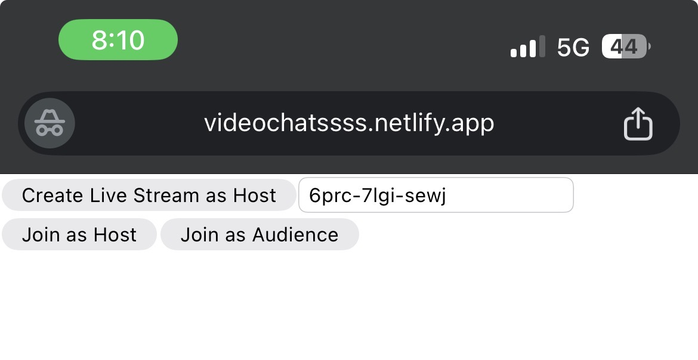
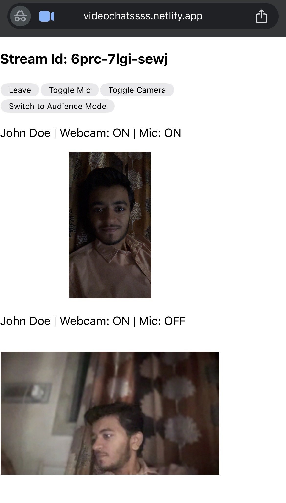

# VideoSDK Coding Examples 🎥

This repository contains **two standalone coding examples** showcasing different features of **VideoSDK**.  
These examples are designed to be simple, easy to run, and helpful for developers to quickly get started with integrating VideoSDK into their applications.

---


You can try the live demo here:  
👉 [Live Demo](https://videochatssss.netlify.app/)

## 📌 Examples Overview

| Example | Features Demonstrated |
|---------|------------------------|
| **Host & Audience Live Stream** | Create/Join as Host, Join as Audience, Stream ID, Mic/Camera toggle, Leave stream |
| **Interactive Live Stream** | Copy/Share Stream ID, Dynamic participant count, Join via shared Stream ID |

---

## 🚀 Getting Started

Follow these steps to run the examples locally:

### 1. Clone this repository
```bash
git clone https://github.com/your-username/videosdk-examples.git
cd videosdk-examples
```


### 2. Install dependencies
```bash
npm install
```


### 3. Setup Environment Variables
```bash
REACT_APP_VIDEOSDK_API_KEY=your_api_key_here
```

### 4. Run the code
```bash
npm start
```

📖 Features

Join as Host or Audience

Enter and use Stream ID

Toggle Mic and Camera

Leave the stream anytime


📸 Screenshot
## 📸 Screenshot

## 📸 Screenshot



---

## 📚 Resources

- [📘 VideoSDK Documentation](https://docs.videosdk.live/)  
- [🛠️ VideoSDK Dashboard](https://app.videosdk.live/)


